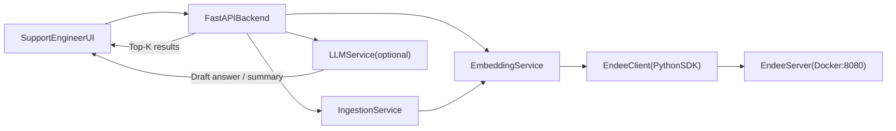

## Endee Support Copilot

Semantic support search and recommendations for tickets, FAQs, and runbooks, powered by **Endee** as the vector database.

---

### Problem Statement

Support and SRE teams spend a lot of time searching across historical tickets, runbooks, FAQs, and incident reports to resolve issues and craft good customer responses. Traditional keyword search breaks down:

- It struggles with phrasing variations (\("504s on checkout" vs. "Gateway timeout on payments API"\)).
- It cannot mix multiple sources (tickets + runbooks + FAQs) with rich metadata like product, severity, and tags.
- It does not help draft a clear, actionable answer.

**Endee Support Copilot** solves this by using **vector-based semantic search** over unified support knowledge stored in **Endee**, with optional RAG-style answer generation from an LLM.

---

### Features

- **Semantic search over support knowledge**: tickets, FAQs, and runbooks embedded into a single Endee index.
- **Metadata-aware filtering**: filter by product, severity, and type \(ticket/FAQ/runbook\).
- **Endee-centric design**: all retrieval is served by Endee; without it the core functionality does not exist.
- **Optional RAG answer generation**: if an LLM API key is configured, the system drafts a suggested reply using retrieved context.
- **Minimal but polished UI**: a single-page interface for support engineers with filters and clearly grouped results.
- **REST API**: FastAPI endpoints for search, ingestion, and health checks.
- **Sample data & ingestion pipeline**: realistic sample tickets, FAQs, and runbooks plus scripts to ingest them into Endee.
- **Basic tests**: lightweight tests around embeddings, Endee client integration, and search flow.

---

### Tech Stack

- **Backend**: Python 3.11, FastAPI, Uvicorn.
- **Vector Database**: Endee \(local Docker, Python SDK\).
- **Embeddings**: `sentence-transformers` \(default: `all-MiniLM-L6-v2`\).
- **LLM \(optional\)**: OpenAI-compatible chat model \(e.g. `gpt-4o-mini`\).
- **Infra / Tooling**: Docker Compose for Endee, `loguru` for logging, `python-dotenv` for configuration.

---

### Architecture

At a high level:

- A support engineer uses a simple web UI to describe an issue and optionally select filters.
- The backend computes an embedding for the query, performs a vector search on Endee with metadata filters, and groups results by type.
- Optionally, an LLM uses the retrieved context to propose a reply.

Conceptual diagram:



**Key components:**

- `config.py`: centralised configuration \(Endee URL/token, index name, embedding model, LLM settings\).
- `services/embeddings.py`: loads the sentence-transformers model and exposes `embed_text` / `embed_texts`.
- `services/endee_client.py`: wraps the Endee Python SDK, ensures the index exists, and exposes `upsert_support_items` and `query`.
- `services/ingestion.py`: reads sample CSV/JSON data and ingests it into Endee with embeddings and metadata.
- `services/search.py`: builds filters, performs semantic search via Endee, and normalises results.
- `services/answer.py`: optional LLM-based answer generation using retrieved context.
- `api/routes_*`: FastAPI routes for search, ingestion, and health.
- `templates/index.html` + `static/style.css`: minimal but modern search UI.

Endee is the **single source of truth** for similarity search and ranking. The backend only orchestrates embedding, filtering, and formatting.

---

### Folder Structure

```text
.
├─ backend/
│  ├─ app/
│  │  ├─ main.py
│  │  ├─ config.py
│  │  ├─ models/
│  │  │  ├─ domain.py
│  │  │  └─ schemas.py
│  │  ├─ services/
│  │  │  ├─ embeddings.py
│  │  │  ├─ endee_client.py
│  │  │  ├─ ingestion.py
│  │  │  ├─ search.py
│  │  │  └─ answer.py
│  │  ├─ api/
│  │  │  ├─ routes_search.py
│  │  │  ├─ routes_ingest.py
│  │  │  └─ routes_health.py
│  │  ├─ templates/
│  │  │  └─ index.html
│  │  └─ static/
│  │     └─ style.css
│  └─ tests/
│     ├─ test_embeddings.py
│     ├─ test_endee_client.py
│     └─ test_search_flow.py
├─ data/
│  ├─ tickets.csv
│  ├─ faqs.json
│  └─ runbooks.json
├─ scripts/
│  ├─ ingest_sample_data.py
│  └─ run_server.bat
├─ .env.example
├─ docker-compose.yml        # Endee server
├─ requirements.txt
└─ README.md
```

This layout mirrors a production-style service: clear separation between API, domain models, services, data, and infra.

---

### Setup Steps

#### 1. Prerequisites

- Python **3.11+**
- Docker + Docker Compose
- Git

#### 2. Run Endee Locally

You must first run Endee, as it is the central vector database.

Option A – Using this project's `docker-compose.yml`:

```bash
docker compose up -d
```

This starts Endee on `http://localhost:8080` with data persisted in a Docker volume.

Option B – Fork Endee’s repository and run it as per official docs:

- Fork `https://github.com/endee-io/endee` to your GitHub.
- Follow the [Endee Quick Start](https://docs.endee.io/quick-start) to build and run the server.
- Ensure it is reachable at `http://localhost:8080` or update `ENDEE_BASE_URL` accordingly.

#### 3. Create and Activate Virtual Environment

From the project root:

```bash
python -m venv .venv
source .venv/Scripts/activate  # on Windows PowerShell: .venv\Scripts\Activate.ps1
pip install --upgrade pip
pip install -r requirements.txt
```

#### 4. Configure Environment

Create a `.env` file based on `.env.example`:

```bash
cp .env.example .env
```

Update values if needed:

- `ENDEE_BASE_URL` if your Endee server is not on `http://localhost:8080/api/v1`.
- `ENDEE_AUTH_TOKEN` if Endee runs in authenticated mode.
- `LLM_API_KEY` \(optional\): set to an OpenAI-compatible key to enable answer generation.

#### 5. Ingest Sample Data

With Endee running:

```bash
python -m scripts.ingest_sample_data
```

This reads `data/tickets.csv`, `data/faqs.json`, and `data/runbooks.json`, embeds each item, and upserts them into the `support_knowledge` index in Endee.

#### 6. Run the Backend

You can use the helper script on Windows:

```bash
scripts\run_server.bat
```

or run Uvicorn directly:

```bash
uvicorn backend.app.main:app --host 0.0.0.0 --port 8000 --reload
```

The app will initialise the Endee client, ensure the index exists, and start serving requests.

---

### Run Instructions

#### UI

- Open `http://localhost:8000` in your browser.
- Type a natural language issue description, for example:
  - `"504 errors on payments API for EU merchants"`
  - `"Users cannot log in after password reset"`
- Optionally set:
  - `Product`: `billing-api`, `auth-service`, etc.
  - `Severity`: `P1`, `P2`, etc.
  - `Types`: `ticket,faq,runbook` \(comma-separated\).
- Click **Search**.

You will see:

- **Similar Tickets**: historical incidents similar to your description.
- **Relevant FAQs**: knowledge base articles that might apply.
- **Runbooks & Procedures**: incident response runbooks relevant to the issue.
- **Suggested Reply** \(if LLM enabled\): a drafted response aggregating the context.

#### API Examples

`POST /search`

```bash
curl -X POST "http://localhost:8000/search" \
  -H "Content-Type: application/json" \
  -d '{
    "query": "504 Gateway Timeout on payments",
    "top_k": 3,
    "filters": {
      "product": "billing-api",
      "severity": "P1"
    },
    "generate_answer": false
  }'
```

Example truncated JSON response:

```json
{
  "query": "504 Gateway Timeout on payments",
  "tickets": [
    {
      "id": "TCK-1001",
      "type": "ticket",
      "title": "Intermittent 504s on payments API",
      "snippet": "504 Gateway Timeout on /v1/payments for EU customers...",
      "product": "billing-api",
      "severity": "P1",
      "score": 0.9231,
      "url": "https://support.example.com/tickets/TCK-1001"
    }
  ],
  "faqs": [
    {
      "id": "FAQ-001",
      "type": "faq",
      "title": "Why am I seeing 504 Gateway Timeout errors on the payments API?",
      "snippet": "504 errors usually indicate that the upstream service did not respond within the configured timeout...",
      "product": "billing-api",
      "severity": null,
      "score": 0.8874,
      "url": "https://support.example.com/faqs/504-payments"
    }
  ],
  "runbooks": [
    {
      "id": "RB-INC-504",
      "type": "runbook",
      "title": "Investigate 504 errors on payments API",
      "snippet": "Confirm the scope of impact... Check billing-api service metrics...",
      "product": "billing-api",
      "severity": "P1",
      "score": 0.8652,
      "url": "https://runbooks.example.com/incidents/payments-504"
    }
  ],
  "llm_answer": null
}
```

`GET /health`

```bash
curl "http://localhost:8000/health"
```

Returns basic app and Endee index info.

---

### How Endee Is Used (Central Role)

- A single Endee index `support_knowledge` stores all support items as vectors:
  - Dense vector: embedding of the canonical text \(title + body/steps\).
  - `meta`: item type \(ticket/faq/runbook\), title, product, severity, tags, URL, and snippet.
  - `filter`: product, severity, and type for efficient filtered search.
- The backend **never** performs its own similarity search – it always sends query vectors to Endee.
- Endee’s `create_index`, `upsert`, `query`, and `describe` APIs are used for index lifecycle and retrieval.
- Without Endee running, the search endpoints will not function; it is not an optional plug-in.

---

### Future Improvements

To push this into a true top-tier project:

- **Hybrid dense + sparse search**: use Endee’s hybrid index to mix semantic vectors with sparse keyword vectors for better control over identifiers and exact terms.
- **Relevance feedback**: capture thumbs up/down on results and use it for re-ranking or offline evaluation.
- **Multi-tenant support**: introduce organisation-level filters and namespaces in Endee.
- **More robust evaluation**: add a `notebooks/evaluation.ipynb` notebook with a small labelled dataset and retrieval metrics.
- **Observability**: expose basic metrics \(latencies, top-k distribution by type\) and structured logs that tie Endee queries to user requests.
- **Authentication & RBAC**: secure the UI/API and the underlying Endee instance for real-world deployments.

---

